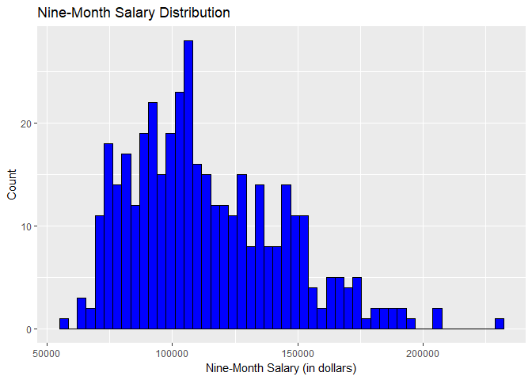

Exploratory Analysis of the Salaries Dataset
================
Nisha Patel
June 21, 2018

This is an exploratory analysis of the Salaries dataset from the carData package in R. This data was collected from a college in the U.S. that contains information on the 2008-2009 nine-month academic salaries of Assistant Professors, Associate Professors, and Professors.

Here are some of the questions I try to address in my analysis below:

1.  What do the distributions of the variables in this dataset look like?

2.  What variables in the dataset can be used to predict nine-month salary for a faculty member?

### Code to Install Packages

``` r
#### Requires: Package name
#### Modifies: Nothing
#### Effects: Installs package if not installed already
install_packages <- function(pkg) { 
  
  # Install package if it is not already
  if (!(pkg %in% installed.packages()[, "Package"])){ 
    
    install.packages(pkg, repos='http://cran.us.r-project.org')
  }
  
  library(pkg, character.only = TRUE)
  
} # end installPackages()

pkg_list = c("tidyverse", "modelr", "carData", "car")
lapply(pkg_list, install_packages)
```

### Descriptive Statistics

Let's take a look at the variables in this dataset:

``` r
df <- Salaries
nrow(df)
```

    ## [1] 397

``` r
colnames(df)
```

    ## [1] "rank"          "discipline"    "yrs.since.phd" "yrs.service"  
    ## [5] "sex"           "salary"

In total, there are 397 observations and 6 variables (n = 367, p = 6).

Let's first take a look at the 3 qualitative variables in the dataset: rank, discipline, and sex.

### Qualitative Variables

``` r
rank_sum <- summary(df$rank)
discpl_sum <- summary(df$discipline)
sex_sum <- summary(df$sex)

rank_sum
```

    ##  AsstProf AssocProf      Prof 
    ##        67        64       266

``` r
discpl_sum
```

    ##   A   B 
    ## 181 216

``` r
sex_sum
```

    ## Female   Male 
    ##     39    358

It appears that a majority of the recorded observations come from Professors (n = 266) with about the same number of data points from Assistant Professors (n = 67) and Associate Professors (n = 64). Fewer faculty members in the dataset work under "Theoretical" departments (coded as A under discipline) compared to the "Applied" departments (coded as B under discipline). There are a lot more male faculty members represented in the dataset (n = 358) compared to female faculty members (n = 39).

### Quantitative Variable Distributions

There are 3 quantitative variables in the Salaries dataset: nine-month salary, years since Ph.D., and years of service. The distributions of these are shown below.

### Nine-Month Salary

``` r
salary_hist <- df %>% ggplot() +
 geom_histogram(aes(x = salary), color = "black", fill = "blue", bins = 50) +
  labs(x = "Nine-Month Salary (in dollars)", y = "Count", 
       title = "Nine-Month Salary Distribution")

salary_hist
```



``` r
summary(df$salary)
```

    ##    Min. 1st Qu.  Median    Mean 3rd Qu.    Max. 
    ##   57800   91000  107300  113706  134185  231545

The distribution for the nine-month salary variable above seems to be skewed right. The Median nine-month salary is $107,300 compared to the mean of $113,706. The minimum salary of a faculty member is $57,800 and the maximum salary is $231,545.

### Years since Ph.D.

``` r
phd_hist <- df %>% ggplot() +
  geom_histogram(aes(x = yrs.since.phd), color = "black", fill = "green", bins = 50) +
  labs(x = "Years since Ph.D.", y = "Count", 
       title = "Years since Ph.D. Distribution")

phd_hist
```


``` r
summary(df$yrs.since.phd)
```

    ##    Min. 1st Qu.  Median    Mean 3rd Qu.    Max. 
    ##    1.00   12.00   21.00   22.31   32.00   56.00

The years since obtaining a Ph.D. variable seems to take on a relatively normal distribution, perhaps showing slight skewness to the right. The median number of years since receiving a Ph.D. for faculty members is 21 years whereas the mean is ~22 years (rounded from the estimate of 22.31 years). Thus 50% of the faculty members received their Ph.D. between 1-21 years ago whereas the other 50% received their Ph.D. between 21-56 years ago.

### Years of Service

``` r
service_hist <- df %>% ggplot() +
  geom_histogram(aes(x = yrs.service), color = "black", fill = "orange", bins = 50) +
  labs(x = "Years of Service", y = "Count", 
       title = "Years of Service Distribution")

service_hist
```


``` r
summary(df$yrs.service)
```

    ##    Min. 1st Qu.  Median    Mean 3rd Qu.    Max. 
    ##    0.00    7.00   16.00   17.61   27.00   60.00

The distribution of years of service seems to be slightly skewed right, similar to the distribution of years since Ph.D. The median number of years that faculty members have served is 16 years whereas the mean is ~17 years (rounded from the estimate 17.61 years).

As we move into assessing the relationship between variables and then modeling, I want to address any observations that should perhaps be excluded from analysis. For example, it may be reasonable to exclude faculty members in the dataset with &lt; 1 year of service.

``` r
exclude_service <- df %>% filter(yrs.service < 1) %>% nrow()
exclude_service
```

    ## [1] 11

One possible explanation for why these 11 people have &lt; 1 year of service is that they just started working at the University when this data was collected. In future analyses, I would recommend seeing what happens when these individuals are taken out of the dataset.

However, for the regression analyses I present later on in this report, I will keep them in! Since only 11 people would be removed, I don't expect them to dramatically affect results. Furthermore as seen above, there is no indication of extreme skewness in the data.

### Assessing Years since Ph.D., Salary, and Rank


It appears that years since Ph.D. is somewhat positively correlated with salary. Generally, as the number of years since a faculty member received their Ph.D. increases, their salary increases as well.

Furthermore, it appears that rank is also somewhat positively correlated with years since Ph.D. and salary as well. Assistant Professors appear to have the lowest nine-month salaries receiving between $57,800-$100,000 (the minimum from above was found to be $57,800. Associate Professors receive a nine-month salary in the range of $50,000-$125,000. Professors tend to have the highest range in nine-month salaries based on the graph.

It is possible that the relationship between years since Ph.D. and nine-month salary is non-linear (quadratic specifically) based on the slight curve pattern in the observations from the plot.

### Assessing Years since Ph.D., Salary, and Discipline

``` r
phd_discipl_rank <-  df %>% ggplot() + 
    geom_point(aes(x = yrs.since.phd, y = salary, color = discipline)) +
    labs(x = "Years since Ph.D.", y = "Nine-Month Salary (in Dollars)",
       title = "Nine-Month Salary vs. Years since Ph.D.")

phd_discipl_rank
```


There does not appear to be a strong relationship between salary and discipline or even between discipline and years since Ph.D. However, it does appear that the data points from faculty members in applied departments are situated higher than data points from faculty members in theoretical departments.

### Assessing Salary, Years of Service, and Rank

``` r
service_salary <-  df %>% ggplot() + 
    geom_point(aes(x = yrs.service, y = salary, color=rank)) +
    labs(x = "Years of Service", y = "Nine-Month Salary (in Dollars)",
       title = "Nine-Month Salary vs. Years of Service")

service_salary
```


There does not appear to be a strong relationship between nine-month salary and years of service, but there is somewhat a relationship between rank and years of service as expected. Faculty members that are Professors or Associate Professors tend to have served longer in departments and therefore hold higher positions and get paid more compared to Assistant Professors.

### Assessing Salary, Sex, Years of Service

``` r
sex_salary <-  df %>% ggplot() + 
    geom_point(aes(x = yrs.since.phd, y = salary, color=sex)) +
    labs(x = "Years of Service", y = "Nine-Month Salary (in Dollars)",
       title = "Nine-Month Salary vs. Years of Service")

sex_salary
```


There does not appear to be a strong relationship between nine-month salary and sex or between sex and years of service. However, as noted previously, more observations in this dataset are from male faculty members (n = 358) compared to female faculty members (n = 39 ).

Regression Analyses
-------------------

Now, let's try to predict nine-month salary. Which variables in the dataset affect salary?

Let's take a brief look at salary regressed upon the variables in simple linear regression models (SLR):

### SLR: Salary~Rank

``` r
mod_rank_slr <- lm(salary~rank, data = df)
summary(mod_rank_slr)
```

    ## 
    ## Call:
    ## lm(formula = salary ~ rank, data = df)
    ## 
    ## Residuals:
    ##    Min     1Q Median     3Q    Max 
    ## -68972 -16376  -1580  11755 104773 
    ## 
    ## Coefficients:
    ##               Estimate Std. Error t value Pr(>|t|)    
    ## (Intercept)      80776       2887  27.976  < 2e-16 ***
    ## rankAssocProf    13100       4131   3.171  0.00164 ** 
    ## rankProf         45996       3230  14.238  < 2e-16 ***
    ## ---
    ## Signif. codes:  0 '***' 0.001 '**' 0.01 '*' 0.05 '.' 0.1 ' ' 1
    ## 
    ## Residual standard error: 23630 on 394 degrees of freedom
    ## Multiple R-squared:  0.3943, Adjusted R-squared:  0.3912 
    ## F-statistic: 128.2 on 2 and 394 DF,  p-value: < 2.2e-16

According to these results, rank does contribute to nine-month salary at this college as expected. Professors and Associate Professors tend to be more experienced than Assistant Professors and thus paid more in accordance with their faculty positions. The baseline group in this case is Assistant Professors. While Assistant Professors at this college have an average nine-month salary of $80,776, Associate Professors earn an additional $13,100 compared to Assistant Professors. Similarly, Professors earn an additional $45,996 compared to the nine-month salary of Assistant Professors. The amount of variance in salary explained by rank in this model is around 39%.

### SLR: Salary~Sex

``` r
mod_sex_slr <- lm(salary~sex, data =df)
summary(mod_sex_slr)
```

    ## 
    ## Call:
    ## lm(formula = salary ~ sex, data = df)
    ## 
    ## Residuals:
    ##    Min     1Q Median     3Q    Max 
    ## -57290 -23502  -6828  19710 116455 
    ## 
    ## Coefficients:
    ##             Estimate Std. Error t value Pr(>|t|)    
    ## (Intercept)   101002       4809  21.001  < 2e-16 ***
    ## sexMale        14088       5065   2.782  0.00567 ** 
    ## ---
    ## Signif. codes:  0 '***' 0.001 '**' 0.01 '*' 0.05 '.' 0.1 ' ' 1
    ## 
    ## Residual standard error: 30030 on 395 degrees of freedom
    ## Multiple R-squared:  0.01921,    Adjusted R-squared:  0.01673 
    ## F-statistic: 7.738 on 1 and 395 DF,  p-value: 0.005667

Although the coefficient for the predictor sex is found to be significant in the model, sex only explains around 2% of the variance in salary in this model. These results can be interpreted as saying female faculty members at this college make an average nine-month salary of $101,002 whereas male faculty members make an additional $14,088 more on top of that.

### SLR: Salary~Discipline

``` r
mod_discpl_slr <- lm(salary~discipline, data = df)
summary(mod_discpl_slr)
```

    ## 
    ## Call:
    ## lm(formula = salary ~ discipline, data = df)
    ## 
    ## Residuals:
    ##    Min     1Q Median     3Q    Max 
    ## -50748 -24611  -4429  19138 113516 
    ## 
    ## Coefficients:
    ##             Estimate Std. Error t value Pr(>|t|)    
    ## (Intercept)   108548       2227  48.751  < 2e-16 ***
    ## disciplineB     9480       3019   3.141  0.00181 ** 
    ## ---
    ## Signif. codes:  0 '***' 0.001 '**' 0.01 '*' 0.05 '.' 0.1 ' ' 1
    ## 
    ## Residual standard error: 29960 on 395 degrees of freedom
    ## Multiple R-squared:  0.02436,    Adjusted R-squared:  0.02189 
    ## F-statistic: 9.863 on 1 and 395 DF,  p-value: 0.001813

Similar to the results above for sex, the coefficient of discipline is found to be significant, but only explains around 2% of the variance in salary in this model. The baseline group is A which suggests that faculty members in theoretical departments make on average $108,548 whereas faculty members in applied departments (B) make an additional $9,480 beyond that of members in theoretical departments.

### SLR: Salary~Years since Ph.D.

``` r
mod_phd_slr <- lm(salary~yrs.since.phd, data = df)
summary(mod_phd_slr)
```

    ## 
    ## Call:
    ## lm(formula = salary ~ yrs.since.phd, data = df)
    ## 
    ## Residuals:
    ##    Min     1Q Median     3Q    Max 
    ## -84171 -19432  -2858  16086 102383 
    ## 
    ## Coefficients:
    ##               Estimate Std. Error t value Pr(>|t|)    
    ## (Intercept)    91718.7     2765.8  33.162   <2e-16 ***
    ## yrs.since.phd    985.3      107.4   9.177   <2e-16 ***
    ## ---
    ## Signif. codes:  0 '***' 0.001 '**' 0.01 '*' 0.05 '.' 0.1 ' ' 1
    ## 
    ## Residual standard error: 27530 on 395 degrees of freedom
    ## Multiple R-squared:  0.1758, Adjusted R-squared:  0.1737 
    ## F-statistic: 84.23 on 1 and 395 DF,  p-value: < 2.2e-16

From this regression model, years since Ph.D. explains about 17% of the variance in salary. For each additional year since receiving their Ph.D., a faculty member's salary estimate increases by an additional $985.30.

### SLR: Salary~Years of Service

``` r
mod_service_slr <- lm(salary~yrs.service,data=df)
summary(mod_service_slr)
```

    ## 
    ## Call:
    ## lm(formula = salary ~ yrs.service, data = df)
    ## 
    ## Residuals:
    ##    Min     1Q Median     3Q    Max 
    ## -81933 -20511  -3776  16417 101947 
    ## 
    ## Coefficients:
    ##             Estimate Std. Error t value Pr(>|t|)    
    ## (Intercept)  99974.7     2416.6   41.37  < 2e-16 ***
    ## yrs.service    779.6      110.4    7.06 7.53e-12 ***
    ## ---
    ## Signif. codes:  0 '***' 0.001 '**' 0.01 '*' 0.05 '.' 0.1 ' ' 1
    ## 
    ## Residual standard error: 28580 on 395 degrees of freedom
    ## Multiple R-squared:  0.1121, Adjusted R-squared:  0.1098 
    ## F-statistic: 49.85 on 1 and 395 DF,  p-value: 7.529e-12

From this regression model, years of service explains about 11% of the variance in salary. For each additional year a faculty member has served, their salary estimate increases by an additional $779.60.

Full Multiple Linear Regression Model
-------------------------------------

Here are the results of the first multiple linear regression model I ran: the full model with salary regressed on all predictors.

``` r
full_mod <- lm(salary~., data = df)

summary(full_mod)
```

    ## 
    ## Call:
    ## lm(formula = salary ~ ., data = df)
    ## 
    ## Residuals:
    ##    Min     1Q Median     3Q    Max 
    ## -65248 -13211  -1775  10384  99592 
    ## 
    ## Coefficients:
    ##               Estimate Std. Error t value Pr(>|t|)    
    ## (Intercept)    65955.2     4588.6  14.374  < 2e-16 ***
    ## rankAssocProf  12907.6     4145.3   3.114  0.00198 ** 
    ## rankProf       45066.0     4237.5  10.635  < 2e-16 ***
    ## disciplineB    14417.6     2342.9   6.154 1.88e-09 ***
    ## yrs.since.phd    535.1      241.0   2.220  0.02698 *  
    ## yrs.service     -489.5      211.9  -2.310  0.02143 *  
    ## sexMale         4783.5     3858.7   1.240  0.21584    
    ## ---
    ## Signif. codes:  0 '***' 0.001 '**' 0.01 '*' 0.05 '.' 0.1 ' ' 1
    ## 
    ## Residual standard error: 22540 on 390 degrees of freedom
    ## Multiple R-squared:  0.4547, Adjusted R-squared:  0.4463 
    ## F-statistic:  54.2 on 6 and 390 DF,  p-value: < 2.2e-16

It is clear in this model that the least statistically significant variable is sex (with a p-value of ~0.22). Interestingly, the coefficient for years of service has switched signs. In the SLR model above run with years of service (Salary~Years of Service), the coefficient was $779.60 whereas in the full model here it is $-489.50. This could be a sign of collinearity. I'll come back to this later.

For now, let's see what happens if we take out the predictor sex. In this case, I think removing sex is justified because it is statistically insignificant in the model.

``` r
mod_no_sex <- lm(salary~rank+discipline+yrs.since.phd+yrs.service, data=df)
summary(mod_no_sex)
```

    ## 
    ## Call:
    ## lm(formula = salary ~ rank + discipline + yrs.since.phd + yrs.service, 
    ##     data = df)
    ## 
    ## Residuals:
    ##    Min     1Q Median     3Q    Max 
    ## -65244 -13498  -1455   9638  99682 
    ## 
    ## Coefficients:
    ##               Estimate Std. Error t value Pr(>|t|)    
    ## (Intercept)    69869.0     3332.1  20.968  < 2e-16 ***
    ## rankAssocProf  12831.5     4147.7   3.094  0.00212 ** 
    ## rankProf       45287.7     4236.7  10.689  < 2e-16 ***
    ## disciplineB    14505.2     2343.4   6.190 1.52e-09 ***
    ## yrs.since.phd    534.6      241.2   2.217  0.02720 *  
    ## yrs.service     -476.7      211.8  -2.250  0.02497 *  
    ## ---
    ## Signif. codes:  0 '***' 0.001 '**' 0.01 '*' 0.05 '.' 0.1 ' ' 1
    ## 
    ## Residual standard error: 22550 on 391 degrees of freedom
    ## Multiple R-squared:  0.4525, Adjusted R-squared:  0.4455 
    ## F-statistic: 64.64 on 5 and 391 DF,  p-value: < 2.2e-16

In this model, all variables are found to be significant with p-values &lt;0.05. The adjusted R-squared value did not change much with the removal of the predictor sex. The coefficient for years of service is still negative, but reduced to $-476.70.

Is there evidence of collinearity? We did see above that years since Ph.D., rank, and years of service show some of the strongest associations with salary and somewhat correlate with each other.

To check this, let's compute the Variance Inflation Factor (VIF) for the model above.

``` r
car::vif(mod = mod_no_sex)
```

    ##                   GVIF Df GVIF^(1/(2*Df))
    ## rank          2.003562  2        1.189736
    ## discipline    1.063139  1        1.031086
    ## yrs.since.phd 7.518920  1        2.742065
    ## yrs.service   5.908984  1        2.430840

According to the results, the VIF for years since Ph.D. is 7.52 and for years of service is 5.91. A VIF value &gt;5 or &gt;10 is a sign of collinearity that can considerably affect results. Let's dig into this by first assessing what happens if we take out years since Ph.D.

``` r
mod_no_phd <- lm(salary~discipline+yrs.service+rank,
                  data = df)

summary(mod_no_phd)
```

    ## 
    ## Call:
    ## lm(formula = salary ~ discipline + yrs.service + rank, data = df)
    ## 
    ## Residuals:
    ##    Min     1Q Median     3Q    Max 
    ## -64198 -14040  -1299  10724  99253 
    ## 
    ## Coefficients:
    ##               Estimate Std. Error t value Pr(>|t|)    
    ## (Intercept)   72253.53    3169.48  22.797  < 2e-16 ***
    ## disciplineB   13561.43    2315.91   5.856 1.01e-08 ***
    ## yrs.service     -76.33     111.25  -0.686 0.493039    
    ## rankAssocProf 14483.23    4100.53   3.532 0.000461 ***
    ## rankProf      49377.50    3832.90  12.883  < 2e-16 ***
    ## ---
    ## Signif. codes:  0 '***' 0.001 '**' 0.01 '*' 0.05 '.' 0.1 ' ' 1
    ## 
    ## Residual standard error: 22670 on 392 degrees of freedom
    ## Multiple R-squared:  0.4456, Adjusted R-squared:   0.44 
    ## F-statistic: 78.78 on 4 and 392 DF,  p-value: < 2.2e-16

``` r
car::vif(mod_no_phd)
```

    ##                 GVIF Df GVIF^(1/(2*Df))
    ## discipline  1.028057  1        1.013932
    ## yrs.service 1.613750  1        1.270335
    ## rank        1.588631  2        1.122679

In this model, taking out years since Ph.D. solved collinearity a little. The VIF estimate for years of service went down to 1.61. However, the sign of the coefficient for years of service is still negative.

Let's instead try removing rank from the model instead of years since Ph.D.

``` r
mod_no_rank <- lm(salary~discipline+yrs.since.phd+yrs.service,
                  data = df)

summary(mod_no_rank)
```

    ## 
    ## Call:
    ## lm(formula = salary ~ discipline + yrs.since.phd + yrs.service, 
    ##     data = df)
    ## 
    ## Residuals:
    ##    Min     1Q Median     3Q    Max 
    ## -76047 -17197  -4709  15904  97194 
    ## 
    ## Coefficients:
    ##               Estimate Std. Error t value Pr(>|t|)    
    ## (Intercept)    77486.4     3405.5  22.754  < 2e-16 ***
    ## disciplineB    16480.7     2713.7   6.073 2.96e-09 ***
    ## yrs.since.phd   1815.6      249.4   7.281 1.82e-12 ***
    ## yrs.service     -752.8      244.5  -3.079  0.00222 ** 
    ## ---
    ## Signif. codes:  0 '***' 0.001 '**' 0.01 '*' 0.05 '.' 0.1 ' ' 1
    ## 
    ## Residual standard error: 26190 on 393 degrees of freedom
    ## Multiple R-squared:  0.258,  Adjusted R-squared:  0.2523 
    ## F-statistic: 45.55 on 3 and 393 DF,  p-value: < 2.2e-16

``` r
car::vif(mod_no_rank)
```

    ##    discipline yrs.since.phd   yrs.service 
    ##      1.057281      5.961779      5.836347

Removing rank from the model did not solve the issue - the sign of years of service is still negative. As for collinearity, years since Ph.D. and years of service both have a VIF &gt; 5.

Now what happens when we take out years of service instead of rank?

``` r
mod_no_service <-lm(salary~discipline+yrs.since.phd+rank,
                  data = df)

summary(mod_no_service)
```

    ## 
    ## Call:
    ## lm(formula = salary ~ discipline + yrs.since.phd + rank, data = df)
    ## 
    ## Residuals:
    ##    Min     1Q Median     3Q    Max 
    ## -67395 -13480  -1536  10416  97166 
    ## 
    ## Coefficients:
    ##               Estimate Std. Error t value Pr(>|t|)    
    ## (Intercept)   71405.40    3278.32  21.781  < 2e-16 ***
    ## disciplineB   14028.68    2345.90   5.980 5.03e-09 ***
    ## yrs.since.phd    71.92     126.68   0.568   0.5706    
    ## rankAssocProf 13030.16    4168.17   3.126   0.0019 ** 
    ## rankProf      46211.57    4238.52  10.903  < 2e-16 ***
    ## ---
    ## Signif. codes:  0 '***' 0.001 '**' 0.01 '*' 0.05 '.' 0.1 ' ' 1
    ## 
    ## Residual standard error: 22670 on 392 degrees of freedom
    ## Multiple R-squared:  0.4454, Adjusted R-squared:  0.4398 
    ## F-statistic: 78.72 on 4 and 392 DF,  p-value: < 2.2e-16

``` r
car::vif(mod_no_service)
```

    ##                   GVIF Df GVIF^(1/(2*Df))
    ## discipline    1.054461  1        1.026869
    ## yrs.since.phd 2.053425  1        1.432978
    ## rank          1.978933  2        1.186063

In this case, taking out years of service did not change the adjusted R-squared value much compared to the full model and none of the remaining variables have a high VIF.

I think taking out years of service as a variable is justified in this case. Since there was a collinearity issue, taking out one of the problematic variables is a way to control for collinearity. Since collinearity means 2 or more variables are closely related, removing one of the variables does not affect the amount of information in the model (you are essentially removing redundant information).

Furthermore, in this model, by taking out years of service, the adjusted R-squared was not affected significantly compared to the model fit with all the variables except sex. Even though the coefficient for years since Ph.D. drops out of significance, I think this model is reasonable. Instead of removing one of the collinear variables from the model, an alternative solution is to combine the variables that are collinear with each other into a single variable to run in the model. On the other hand, more observations and a better understanding of the factors affecting salary at this university are needed in order to develop a more informative model to predict salary.

From this brief analysis, I believe that the best multiple linear regression model I can currently construct for the Salaries dataset in order to predict nine-month salary has the two predictors rank and discipline.

Here is a summary of this final model and a look at its residuals.

``` r
mod_final <- lm(salary~discipline+rank,data=df)
summary(mod_final)
```

    ## 
    ## Call:
    ## lm(formula = salary ~ discipline + rank, data = df)
    ## 
    ## Residuals:
    ##    Min     1Q Median     3Q    Max 
    ## -65990 -14049  -1288  10760  97996 
    ## 
    ## Coefficients:
    ##               Estimate Std. Error t value Pr(>|t|)    
    ## (Intercept)      71944       3135  22.948  < 2e-16 ***
    ## disciplineB      13761       2296   5.993 4.65e-09 ***
    ## rankAssocProf    13762       3961   3.475 0.000569 ***
    ## rankProf         47844       3112  15.376  < 2e-16 ***
    ## ---
    ## Signif. codes:  0 '***' 0.001 '**' 0.01 '*' 0.05 '.' 0.1 ' ' 1
    ## 
    ## Residual standard error: 22650 on 393 degrees of freedom
    ## Multiple R-squared:  0.445,  Adjusted R-squared:  0.4407 
    ## F-statistic:   105 on 3 and 393 DF,  p-value: < 2.2e-16

``` r
# plot residuals vs. fitted values
plot(mod_final, which = 1)
```


The predictors in this case explain ~44% of the variance in nine-month salary. I think this is justified because there are still other factors that contribute to determining nine-month salary for faculty members at this college that are absent in this dataset or not well understood yet (such as years since Ph.D. and years of service). However, it should be noted that the residual plot is not free of patterns. Therefore, there is still work to do in order to identify the best model.

One missing influential factor could be which college at the University a department may be listed under. This can affect how much money from a budget a department has to spread amongst its faculty. Another consideration is how the non-academic job market affects university jobs. If a field has a thriving non-academic job market, then universities need to account for that and perhaps offer higher salaries to hire faculty members in that particular field.

That's it for now! Thank you for taking a brief look at my preliminary findings from the Salaries dataset. I enjoyed doing exploratory analysis on this dataset and running some regression models. As I continue to develop my skills, I will definitely come back and update my work!
